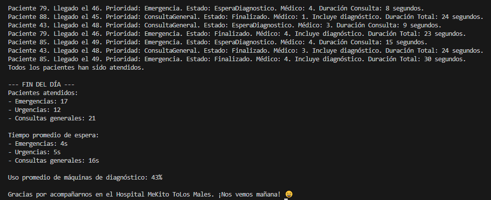
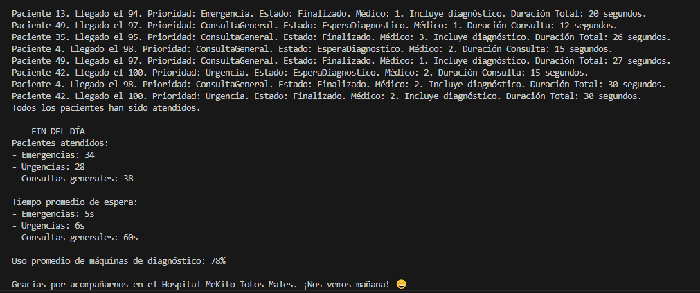
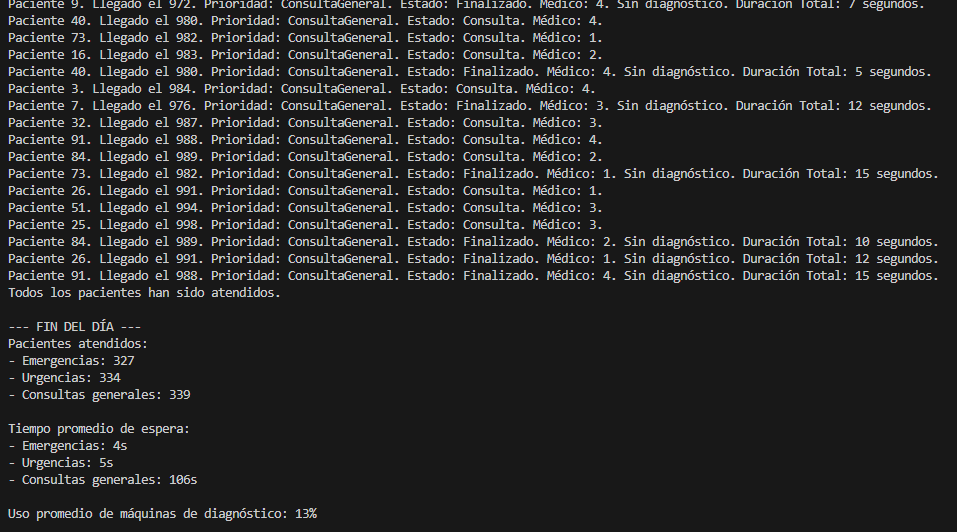

# 🏥 Ejercicio 3.

## 📌 Descripción de la Tarea

En este nuevo ejercicio vamos a seguir con la misma lógica que en el último apartado y lo que haremos es testear el código en función de si son 50, 100 o 1000 pacientes como se comportará el mismo. 

Cada paciente que llega al hospital tiene los sguientes datos que son :

- **ID único aleatorio** entre 1 y 100.
- **Tiempo de llegada al hospital**, expresado en segundos (empezando desde 0 y luego de dos en dos).
- **Duración de la consulta**, aleatoria entre 5 y 15 segundos.
- **Duración del diagnóstico** 15 segundos.
- **Prioridad médica**, que puede ser:
  - `Emergencia` (nivel 1)
  - `Urgencia` (nivel 2)
  - `Consulta general` (nivel 3)
- **Estado**, que puede ser:
  - `EsperaConsulta`
  - `Consulta`
  - `EsperaDiagnostico`
  - `Finalizado`
- **Diagnóstico** Si el paciente requiere diagnóstico o no. 

---

## 😷 50 pacientes
- Ejecuté la simulación con 50 pacientes, llegando cada 2 segundos.
- Observé que los pacientes fueron atendidos según prioridad y orden de llegada.
- Se respetaron los turnos de consulta y el uso de las máquinas de diagnóstico.
Al final se mostraron correctamente las estadísticas.

### 🩺  ¿Cumple requisitos?
Con 50 pacientes, el sistema funciona sin problemas. Se cumplen los requisitos establecidos: se respetan las prioridades, los pacientes esperan si no hay médico, se hacen diagnósticos cuando corresponde y al final se muestra un resumen claro de lo que ha pasado en el día.
### 🔍  ¿Que comportamientos no previstos detectas?
No se detectaron comportamientos inesperados. Todo fluye correctamente. Lo único es que los pacientes con prioridad baja pueden tardar más en ser atendidos. 
### 🛠️  ¿Cómo adaptarías tu solución?
No haría falta grandes cambios. Tal vez podría mostrar el progreso en tiempo real.

## 😷 100 pacientes
- Ejecuté la simulación con 100 pacientes, con llegada cada 2 segundos.
- Observé el comportamiento en consola y las estadísticas finales.
- Verifiqué que todos los pacientes fueran añadidos correctamente, atendidos por prioridad, y que las máquinas de diagnóstico funcionaran de forma concurrente.
- Revisé que las estadísticas de fin de día se calcularan correctamente.

### 🩺  ¿Cumple requisitos?
Sí, el sistema cumple los requisitos, pero ya se nota cierta carga y saturación en la atención. Se siguen respetando las prioridades y el orden de llegada, pero el tiempo de espera empieza a subir, sobre todo para los pacientes con menor prioridad. Las máquinas de diagnóstico se usan casi todo el tiempo y el flujo general de pacientes es más lento, aunque el comportamiento del sistema sigue siendo correcto.
### 🔍  ¿Que comportamientos no previstos detectas?
Al haber más pacientes, empiezan a aparecer comportamientos no tan visibles con pocos pacientes. Por ejemplo:
- Hay más acumulación de pacientes esperando diagnóstico.
- El uso de tareas crece mucho, y podría empezar a sobrecargar el sistema si se sigue escalando.
- El Task.Delay final en main puede quedarse corto si la ejecución es muy larga, y algunos pacientes podrían quedar sin finalizar si no se alarga.
- Aumenta mucho la espera en EsperaConsulta para las prioridades más bajas.
### 🛠️  ¿Cómo adaptarías tu solución?
Podríamos realizar algunos ajustes como por ejemplo: 
- Reemplazar el Task.Delay final por un sistema que espere a que todos los pacientes estén en estado Finalizado
- Controlar mejor la creación de tareas para evitar sobrecarga, por ejemplo, usando colas de procesamiento más controladas.
- Mostrar una barra de progreso o conteo en tiempo real para ver cómo avanza la simulación con muchos pacientes.

## 😷 1000 pacientes
- Ejecuté la simulación con 1000 pacientes, simulando llegadas cada 2 segundos.
- Observé el comportamiento general, el rendimiento del sistema, y si se cumplían los procesos de atención, diagnóstico y generación de estadísticas.
- Revisé si todos los pacientes eran atendidos correctamente y si el programa finalizaba como estaba previsto.

### 🩺  ¿Cumple requisitos?
En este caso, el sistema empieza a llegar a su límite. Técnicamente se siguen cumpliendo los requisitos, pero el tiempo de simulación se vuelve excesivamente largo y aparecen ciertos problemas de rendimiento. Se evidencia que el sistema no estaba pensado para manejar volúmenes tan altos sin optimizaciones.
### 🔍  ¿Que comportamientos no previstos detectas?
Con 1000 pacientes aparecen varios comportamientos inesperados:
- La simulación tarda mucho en completarse, ya que con una llegada cada 2 segundos, el último paciente entra después de más de 30 minutos.
- Se generan demasiadas tareas en paralelo, lo que puede saturar el sistema y afectar el rendimiento.
- Algunos pacientes podrían no llegar a ser atendidos si no se ajusta correctamente el tiempo de espera total o no se espera a que finalicen todos.
- Las colas de espera se hacen muy largas y difíciles de gestionar visualmente.
- Hay algunos pacientes que no pueden ser atendidos ya que la capacidad máxima de la consulta está en su límite.

- Se repiten los id ya que se generan aleatoriamente del 1 al 100. Podemos encontrar dos pacientes o más con el mismo id.  
### 🛠️  ¿Cómo adaptarías tu solución?
Podríamos realizar algunos ajustes como por ejemplo: 
-  Reemplazar completamente el Task.Delay final por una espera dinámica que verifique que todos los pacientes han sido atendidos.
- Modificar la lógica de llegada de pacientes para que no sea real, sino instantánea o acelerada en pruebas grandes.
- Optimizar el manejo de tareas, limitando cuántas se lanzan al mismo tiempo. Por ejemplo, usando una cola de tareas en lugar de Task.Run ilimitado.
-  Agregar una opción para configurar el número de médicos y máquinas según la cantidad de pacientes, para evitar cuellos de botella.
- Incluir estadísticas parciales por bloques,cada 100 pacientes, por ejemplo, para monitorear el sistema sin esperar hasta el final.

📌 **Conclusión:**  
> A medida que aumenta el número de pacientes, el sistema sigue funcionando correctamente en cuanto a lógica y prioridades, pero se empiezan a notar limitaciones de rendimiento y tiempos de espera. Con pocos pacientes va fluido, pero al llegar a volúmenes grandes como 1000, se vuelve necesario optimizar el control de tareas, el tiempo de simulación y la gestión de recursos para que el programa siga siendo eficiente y realista.